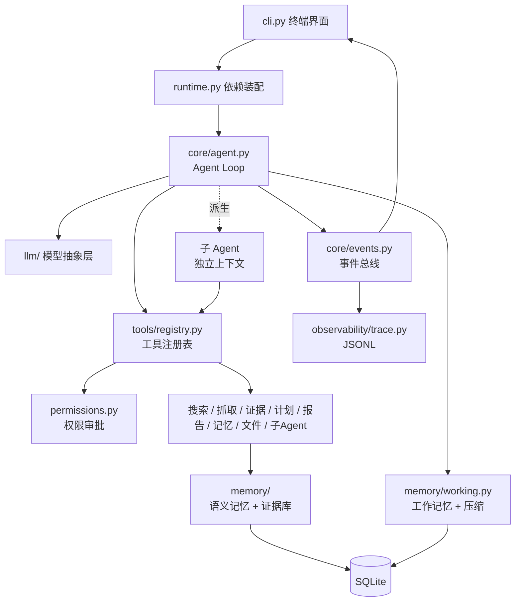
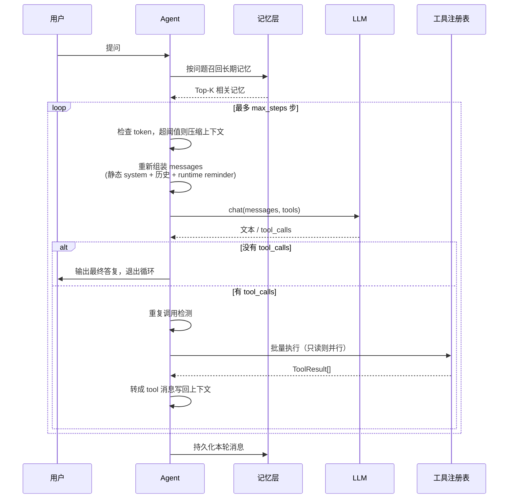
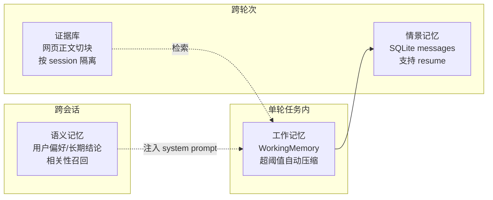
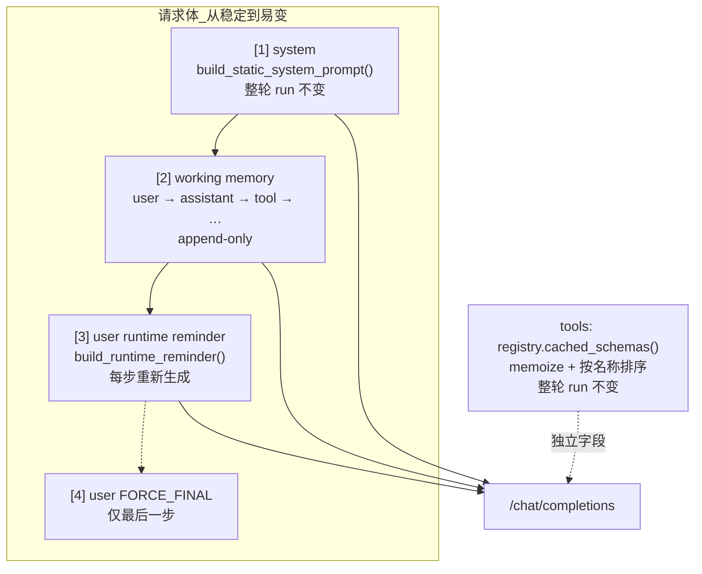
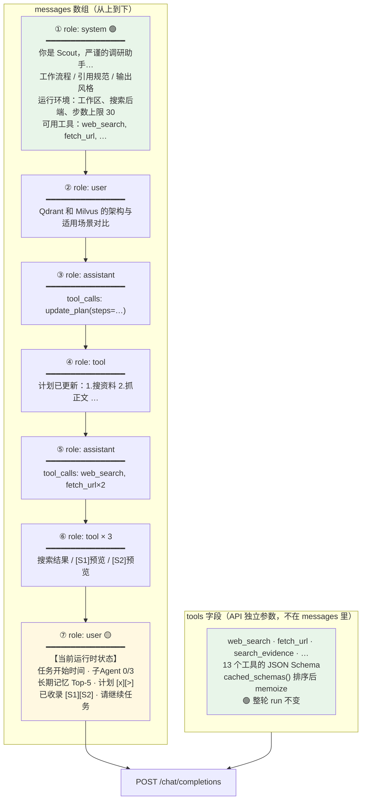
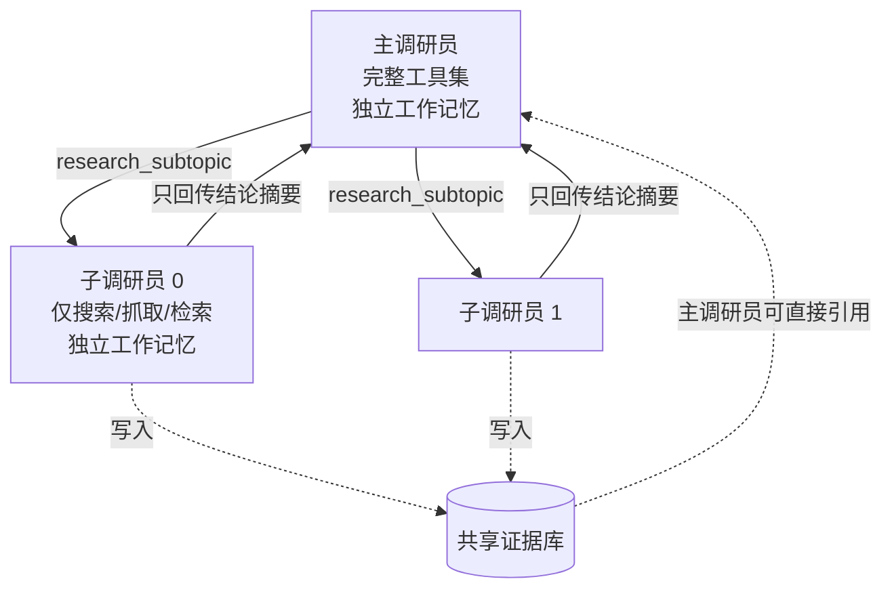
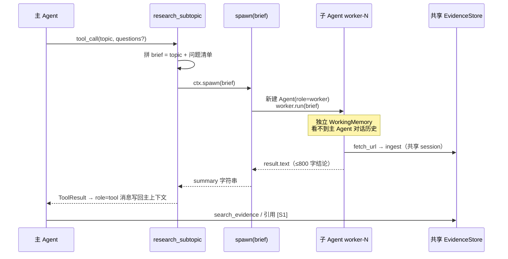
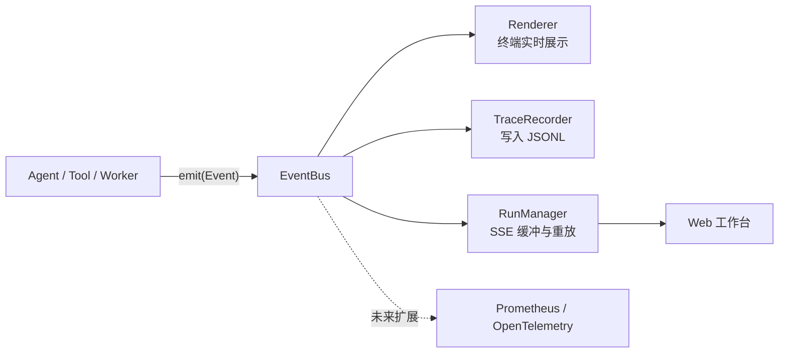
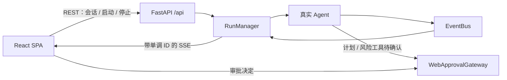
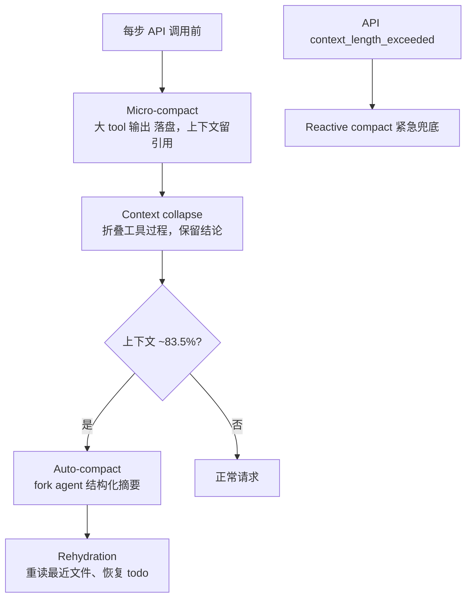

# Scout 技术方案

> 一个调研型 AI Agent 的完整设计与取舍记录。

## 1. 目标与非目标

**目标**：用尽可能少的依赖，把一个"能在真实长任务上跑通"的 Agent 需要的所有机制都显式实现出来——Agent Loop、工具调用、上下文管理、分层记忆、多 Agent 编排、权限控制、可观测性。每一处设计决策都能说清楚为什么这么选。

**非目标**：不做通用框架，不追求覆盖所有场景。不实现分布式调度、不做多租户、不接入向量数据库中间件——这些在单机调研场景下是过度设计。

选"调研"作为落地场景，是因为它对 Agent 的能力覆盖最全面：需要规划（拆子问题）、需要多轮工具调用（搜索→抓取→检索）、需要处理海量上下文（十几篇网页正文）、需要事实可追溯（引用来源）、需要跨会话记忆（用户偏好）。

## 2. 语言选型

**Python**。理由：

| 维度 | Python | TypeScript | Go / Rust |
| --- | --- | --- | --- |
| 模型 SDK 覆盖 | 最全，新特性首发 | 主流厂商齐全 | 多为社区维护 |
| 数据/向量生态 | numpy、faiss、pandas 一应俱全 | 薄弱 | 薄弱 |
| 评测与实验工具 | 最成熟 | 少 | 几乎没有 |
| 并发模型 | GIL 限制，但 Agent 是 IO 密集，线程池够用 | 事件循环天然适合 | 最强 |
| 长期部署 | 依赖较重 | 中等 | 单二进制最轻 |

Agent 的瓶颈是**模型延迟**（一次调用几秒）而不是 CPU，所以 Python 的性能劣势基本不体现。真正影响开发效率的是生态成熟度，这一点 Python 优势明显。

TypeScript 的合理场景是：Agent 要嵌进 Node 后端或前端应用（Vercel AI SDK、Mastra 生态）。Go/Rust 通常只用来做 Agent 的执行沙箱、网关或工具服务，不写 Agent 本体。

## 3. 整体架构



分层原则：**上层依赖下层的抽象，不依赖实现**。`runtime.py` 是唯一知道"谁依赖谁"的地方，其余模块只接收注入的对象。这让单测能把 `OpenAICompatClient` 换成 `FakeLLM`、把真实工具换成假工具，而业务代码一行不改。

## 4. Agent Loop

### 4.1 主流程



### 4.2 循环里真正重要的四件事

框架代码本身只有几十行，决定成败的是这些防护：

**（1）终止条件必须有两个。** 正常终止是模型不再请求工具；兜底终止是步数上限。撞上限时**不能直接抛错走人**——那样用户什么都拿不到。Scout 的做法是最后一步不再提供 `tools` 参数并追加一条强制收尾指令，逼模型基于现有信息给出答复，说明查到了什么、还缺什么。

**（2）工具失败不能中断循环。** 所有工具异常都在 `Tool.run` 里被捕获并转成 `ToolResult(ok=False, content="[工具执行失败] ...")`，作为一条普通的 tool 消息回灌给模型。对模型来说这只是一次"观察"，它会读懂错误并换个参数重试——这就是 Agent 的自愈能力。如果让异常冒泡，一个 404 就能终结整轮任务。

**（3）每个 tool_call 都必须有对应的 tool 消息。** 哪怕这次调用被权限拦截、被重复检测拦下，也要造一条 tool 消息回去。OpenAI 协议要求 `tool_call_id` 严格配对，缺一条服务端直接 400。这是实现 Agent 时最常踩的坑之一。

**（4）重复调用要主动拦截。** 模型陷入"同一个搜索反复查"的循环时，与其烧钱不如明确告诉它：

```python
if signatures.count(signature) >= REPEAT_LIMIT:
    blocked[call.id] = "你已经用完全相同的参数调用过 N 次了，请换个思路…"
```

实测这条提示能让模型立刻改变策略，比单纯限制步数有效得多。

### 4.3 流式输出与工具执行时序

Scout 默认开启流式（`stream=True`），但**流式只用于文本展示，不用于提前执行工具**：

| 阶段 | 流式行为 | 工具行为 |
| --- | --- | --- |
| LLM 生成中 | 文本 token 通过 `on_delta` → `LLM_DELTA` 事件，CLI/Web 实时显示 | tool_call 的 `name` / `arguments` 在 `OpenAICompatClient._chat_stream` 里按 `index` 分片累积，**不 dispatch** |
| `llm.chat()` 返回后 | 发出 `LLM_END` | `agent.py` 调用 `_run_tools()`，`ToolRegistry.execute_batch` 批量执行（只读则并行） |

因此当前时序是：**整轮 assistant 消息（含完整 tool_calls）收齐 → 再执行工具**。这与 Claude Code 的 StreamingToolExecutor（tool_use block 一到即执行）不同；后者能把约 1s 的工具延迟藏进 5–30s 的模型生成窗口里。详见 [§14.2](#142-streaming-tool-execution流式工具执行) 与 [§13 后续演进](#13-后续演进)。

## 5. 工具系统

### 5.1 写工具 = 写普通函数

```python
@tool(risk=Risk.SAFE)
def web_search(
    ctx: ToolContext,
    query: Annotated[str, "搜索关键词。一次只查一个具体问题"],
    limit: Annotated[int, "返回结果条数，1~10"] = 6,
) -> ToolResult:
    """联网搜索，返回标题、URL 和摘要片段。

    搜索结果只是线索，摘要不能作为结论依据；确认有价值后应当用 fetch_url 抓正文。
    """
```

装饰器读取函数签名与类型注解，自动生成 JSON Schema：

- `Annotated[T, "说明"]` → 参数的 `description`
- `Literal["a", "b"]` → `enum`
- `X | None` → 解包成 `X`
- 有默认值 → 可选参数，默认值一并写入 schema
- 第一个参数名为 `ctx` → 运行时注入，**不出现在 schema 里**

**为什么不手写 schema**：手写意味着实现和声明两处维护，改了参数忘了改 schema 是必然会发生的事，而且这类 bug 的表现是"模型传了个不存在的参数"，排查起来非常绕。

**docstring 就是工具描述**，模型选哪个工具主要看它。所以工具描述里写的不只是"这个工具做什么"，还有"什么时候该用它、什么时候不该用"——上面 `web_search` 的第二段就是在防止模型只看搜索摘要就下结论。

### 5.2 三级风险与审批

| 等级 | 含义 | 例子 | ask 模式下 |
| --- | --- | --- | --- |
| SAFE | 只读无副作用 | 搜索、抓取、读文件 | 直接执行 |
| CAUTION | 有副作用但可控 | 写文件、发 HTTP 请求、写记忆 | 询问用户 |
| DANGEROUS | 可能不可逆 | 执行命令、删除 | 询问用户 |

权限模式：`ask`（默认，交互确认，可选"本会话都同意"）/ `auto`（无人值守）/ `readonly`（禁止一切副作用）。

关键点是**把「模型决定做什么」和「系统允许做什么」分开**。模型的输出永远是不可信输入，审批层是最后一道闸门。

### 5.3 并发策略

一轮里模型可能同时请求多个工具。规则很简单：**全部只读则并行，只要有一个带副作用就退化串行**。

调研场景下这个收益很直接——一次并发抓 4 个网页，从 8 秒变成 2 秒。而串行兜底避免了"两个工具同时写同一个文件"这类难以复现的竞态。

## 6. 记忆体系

这是最容易被做浅的一层。很多项目所谓的"记忆"就是把历史消息全塞回去，那不叫记忆，叫累积。Scout 分四层，每层解决不同问题：



| 层 | 生命周期 | 存储 | 检索方式 |
| --- | --- | --- | --- |
| 工作记忆 | 单轮任务 | 内存 | 全量在上下文里 |
| 情景记忆 | 永久 | SQLite `messages` | 按 session_id 加载 |
| 证据库 | 会话级 | SQLite `evidence` + 向量 | 语义检索 / 关键词兜底 |
| 语义记忆 | 永久 | SQLite `memories` + 向量 | 每轮开始按问题召回 Top-5 |

### 6.1 上下文压缩：难点不在摘要

超过阈值时把早期消息交给模型摘要，这部分是常规操作。真正的坑有两个：

**（1）不能切断工具调用链。** 如果切点落在 `assistant(tool_calls)` 和它对应的 `tool` 消息之间，被保留的 tool 消息的 `tool_call_id` 就成了悬空引用，服务端直接报 400。所以切点必须往后挪到非 tool 消息：

```python
def _safe_split_index(self) -> int:
    index = max(len(self.messages) - self.keep_recent, 0)
    while index < len(self.messages) and self.messages[index].role == "tool":
        index += 1
    return index
```

这条有专门的回归测试 `test_compaction_never_orphans_tool_messages`，它遍历压缩后的所有 tool 消息，验证每一条都能在前面找到对应的 tool_call。

**（2）原始任务必须原文保留。** 摘要难免失真，一旦目标被改写，后面几十步全会跑偏。所以第一条 user 消息永远原样保留，只压缩它之后的内容。

**（3）压缩只影响内存，不删数据库。** SQLite 里始终是完整的原始记录，压缩是为了省上下文，不是为了删历史。`/resume` 恢复的是完整对话。

与 Claude Code 多层上下文管理的对比及 Scout 可改进方向，见 [§14.1](#141-上下文压缩context-compaction)。

### 6.2 证据库：让结论可追溯

这是调研 Agent 与普通聊天机器人的分水岭。

`fetch_url` 抓完正文后自动做三件事：按段落切块（900 字符，120 重叠）、批量向量化、入库并分配 `[S1]` 这样的引用标签。之后：

- 模型只拿到正文预览（6000 字符），全文留在库里 —— **上下文只付摘要的成本**
- 需要核对细节时用 `search_evidence` 精确检索，比重抓整页省 token
- 写报告时每条结论标注 `[S1]`，`write_report` 自动追加参考文献并统计引用覆盖率

没有这一层，模型会把"看起来合理的说法"和"查证过的事实"混在一起输出，而这种报告的危害比没有报告更大。

### 6.3 为什么是 SQLite

单机调研场景数据量在万级以内，向量直接以 JSON 存字段、内存里算余弦，几万条的相似度计算是毫秒级。SQLite 零运维、单文件可迁移、WAL 模式支持并发读。

真到了需要换 pgvector / Qdrant 的量级，只需要替换 `memory/store.py` 这一层实现，上层接口不变。**在需要之前引入向量数据库，只是给自己加运维负担。**

没有配置 embedding 模型时自动退化为关键词检索，中文用 bigram 切分（"向量数据库" → 向量/量数/数据/据库），保证零配置也能用。

## 7. 上下文工程

Agent 的上下文不是「设一次 system 就完事」，而是 **Agent Loop 每一步调 LLM 前** 由 `Agent._assemble()` 临时拼好整包请求。`WorkingMemory` 只存 user / assistant / tool 对话；system、runtime reminder 都不入库。

### 7.1 何时组装、组装什么

用户一次提问触发一次 `run()`，内部可能 loop 十几步。**每一步**的顺序是：

```
_maybe_compact()          → token 超阈值则压缩 working memory
_assemble()               → 拼 messages
llm.chat(messages, tools) → 发请求
working.add(assistant)    → 工具结果写回 working memory
```

对应代码：`core/agent.py` 主循环 + `core/prompts.py` 组装函数。

### 7.2 完整 API 请求结构

一次 LLM 调用由 **messages 数组** 和 **tools 数组** 两部分组成（OpenAI 兼容协议）：



| 部分 | 代码入口 | 整轮 run 内是否变化 | 持久化 |
| --- | --- | --- | --- |
| static system | `build_static_system_prompt()` | **否** | 否，每步重新生成但内容相同 |
| tools schema | `ToolRegistry.cached_schemas()` | **否** | 否，API 独立字段 |
| working memory | `WorkingMemory.messages` | append-only | 是，写入 SQLite messages |
| runtime reminder | `build_runtime_reminder()` | **是**（每步） | 否，仅当次请求 |
| FORCE_FINAL | `FORCE_FINAL` 常量 | 仅最后一步 | 否 |

#### 举例：Step 5 发给 LLM 的完整上下文

假设用户问「Qdrant 和 Milvus 的架构与适用场景对比」，主 Agent 已执行 4 步（定计划、搜索、抓了 2 个网页）。**第 5 步**调 LLM 时，请求体从上到下长这样：



图例：🟢 **整轮不变**（利于 prefix cache）　🟡 **每步更新**（放末尾，少 invalidate 前缀）

**各块实际内容对照：**

| 序号 | role | 来源 | 示例内容（缩写） |
| --- | --- | --- | --- |
| tools | — | `registry.cached_schemas()` | `[{name: web_search, parameters:…}, {name: fetch_url,…}, …]` |
| ① | system | `build_static_system_prompt()` | 「你是 Scout…」+ 工作区 `/code` + Tavily + 上限 30 步 |
| ② | user | `working.memory[0]` | 用户原始问题（pinned，压缩也不删） |
| ③④ | assistant → tool | working memory | `update_plan` 调用链 |
| ⑤⑥ | assistant → tool×N | working memory | 搜索 + 并行抓取，tool 返回含 `[S1]` 预览 |
| ⑦ | user | `build_runtime_reminder()` | 计划进度、`[S1] Milvus 文档`、`[S2] Qdrant 文档` |

**不在 messages 里的东西：**

- 网页全文 → SQLite `evidence` 表（`fetch_url` 入库），上下文里只有预览
- 子 Agent 的中间过程 → 只有最终结论以 `tool` 消息回到主上下文（见 §8.2）

**最后一步（step = max_steps）额外追加：**

```
⑧ role: user  「已达到步数上限，不能再调工具，请立刻收尾…」  ← FORCE_FINAL
   且 tools=None（不再提供工具列表）
```

**prefix cache 视角：** Step 5 相比 Step 4，①～⑥ 的前缀不变（只多了 ⑤⑥ 若 Step 4 刚执行完则 ①～④ 相同），只有 ⑦ 的 reminder 文案变了。Step 2+ 的 `cached_tokens` 应 > 0。

`build_static_system_prompt()` = `LEAD_SYSTEM` + 固定运行环境（`_static_runtime_block`）：

```
LEAD_SYSTEM（prompts.py 写死）
├── 工作流程：拆解 → 搜集 → 交叉验证 → 综合 → 产出
├── 工具使用原则：并行只读、派子 Agent、失败自愈、remember
├── 引用规范：[S1] 标注、推测显式标明、禁止编造 URL
└── 输出风格：中文、结论先行、不确定就说不确定

运行环境（固定部分）
├── 工作区路径
├── 搜索后端
├── 本轮步数上限
└── 可用工具名称列表
```

子调研员（`role=worker`）用 `build_worker_static_prompt()`，只含 `WORKER_SYSTEM`，不含计划/来源/长期记忆。

### 7.4 runtime reminder 是干什么的

`build_runtime_reminder()` 在**每步调 LLM 前**生成一条 `role=user` 消息，追加在 messages **最末尾**。作用是：把「会变的状态」集中塞给模型，又**不污染** static system 和 working memory。

**它组织的信息（主调研员）：**

| 块 | 函数/来源 | 每步是否变 | 作用 |
| --- | --- | --- | --- |
| 标记行 | `【当前运行时状态】` | 否 | 让模型识别这是状态快照，不是用户新提问 |
| 任务开始时间 | `run_started_at`，`run()` 入口取一次 | **否**（整轮相同） | 给模型时间锚点，不是实时钟 |
| 子 Agent 配额 | `session.subagents_used / max_subagents` | **是**（派子 Agent 后变） | 告诉模型还能派几个 |
| 长期记忆 | `run()` 入口 `_recall()` Top-5 | **否**（整轮相同） | 跨会话用户偏好/结论 |
| 调研计划 | `session.plan.render()` | **是**（`update_plan` 后变） | 当前进度 [x]/[>]/[ ] |
| 已收录来源 | `session.evidence.sources()` | **是**（`fetch_url` 后变） | `[S1]` 清单，写报告前核对 |
| 收尾句 | 「请基于以上最新状态继续任务。」 | 否 | 提示模型按最新状态继续 |

子调研员用更短的 `build_worker_runtime_reminder()`（只有开始时间 + 搜索后端）。

**reminder 不写入 working memory**——不 persist、不参与压缩，下一步会重新生成一条新的。

#### 任务开始时间会影响 prefix cache 吗？

**不会（在同一次 `run()` 内）。** 时间在 `run()` 开始时只取一次：

```python
run_started_at = format_run_timestamp()  # 仅一次
# 之后每步 _assemble(..., run_started_at=run_started_at) 传入同一个字符串
```

所以 Step 2、Step 5 的 reminder 里「任务开始时间」字段**字节级相同**。它**不是**以前那种每步 `time.strftime()` 刷新的「当前时间」——那种写法如果放在 system 里，确实每步 invalidate cache；这正是 refactor 时把它改成 **run 级固定时间戳** 并放进**末尾 reminder** 的原因。

**真正让 reminder 每步变的是：** 子 Agent 配额、计划、来源清单。但因为 reminder 在 messages **最后**，prefix cache 保护的是它**前面**的 `[system][user][assistant/tool…]`。reminder 本身变了，只影响末尾 suffix 的 token 重算，不会 invalidate 前面的大段前缀。

```
Step 4:  [system][历史…][reminder_v4]     ← 前缀到 reminder 前
Step 5:  [system][历史…+新tool][reminder_v5]
          └──── cache 可命中 ────┘  └─ 仅这块重算 ─┘
```

### 7.5 设计取舍

**为什么 volatile 状态放 reminder 而不是 system？**

Provider 的 prefix cache 按前缀字节匹配。若计划、来源清单写进 system，每抓一个网页 system 就变，前面的大段前缀 cache 全部失效。静态 system + append-only 历史 + 末尾 reminder，只有 suffix 在变（Claude Code / Cursor 同款思路）。

**为什么 reminder 不放进 working memory？**

它是「当前状态快照」，不是对话内容。不持久化、不参与压缩，避免历史里堆叠过期副本。

**计划为什么仍有效？**

计划存在 `session.plan`（外置状态），每步通过 reminder 注入最新渲染结果，不受上下文压缩影响，是把长任务拉回正轨的锚点。

### 7.6 Prefix cache 与 tools cache block

智谱 GLM（`open.bigmodel.cn`）等平台提供**隐式**上下文缓存，无需 `cache_control`。前缀（static system + tools + 已有对话）一致即可命中。响应字段 `usage.prompt_tokens_details.cached_tokens`；`llm_end` trace 事件同步记录 `cached_tokens`。详见[智谱官方文档](https://docs.bigmodel.cn/cn/guide/capabilities/cache)。

Scout 的三层 cache-friendly 布局：

| 层 | 作用 |
| --- | --- |
| static system | 角色准则 + 固定环境，整 run 字节级不变 |
| `cached_schemas()` | 工具 schema memoize 并按名称排序，避免 dict 顺序抖动导致 cache miss |
| append-only 历史 | 每步只追加 assistant / tool，前缀随步数增长但旧部分不变 |

**注意**：上下文压缩（§6.1）会用摘要替换 early history，会打断 prefix cache——这是省 token 的必要代价。压缩只动 working memory，不动 SQLite 完整记录。

验证 cache 命中：

```bash
jq -r 'select(.type=="llm_end") | "\(.step) prompt=\(.prompt_tokens) cached=\(.cached_tokens)"' .scout/traces.jsonl
```

Step 1 通常 `cached=0`（冷启动）；Step 2+ 在布局正确时应看到 `cached_tokens` 上升。

## 8. 多 Agent 编排



**核心设计：上下文隔离 + 证据共享。**

一个子课题往往要搜 3 次、抓 5 个网页，几万 token 的原始资料如果全进主上下文，主 Agent 很快就"失忆"。派子 Agent 去做，它在自己的上下文里翻完所有资料，只把 800 字的结论带回来。主上下文只承担摘要的成本，而**抓到的证据沉淀在共享证据库里，主 Agent 照样能引用 `[S3]`**。

### 8.1 什么时候会派生子 Agent

**没有自动触发**——只有主 Agent 的 LLM 在某一步 **主动调用 `research_subtopic` 工具** 时才会派生。系统不会在后台偷偷开子 Agent。

主 Agent 的 system 准则里写了典型场景（`prompts.LEAD_SYSTEM`）：

> 子课题工作量大时，用 `research_subtopic` 派子调研员去做。它有独立的上下文，只把结论带回来。

适合派子的判断（由模型自行决定，代码不做硬编码）：

| 适合派子 Agent | 不适合派子 Agent |
| --- | --- |
| 子课题需要多次搜索、抓取、阅读 | 简单事实查一下就能答 |
| 原始资料很多，但主 Agent 只需要一段结论 | 主 Agent 自己几步就能查完 |
| 可拆成彼此独立的 parallel 子课题 | 强依赖主上下文才能理解的任务 |

**硬约束（代码层）**——即使模型想派，以下情况也会被拦：

| 条件 | 行为 |
| --- | --- |
| `session.subagents_used >= max_subagents`（默认 3） | 工具返回失败，提示配额用完 |
| 子 Agent 内部 | 没有 `research_subtopic` 工具，**不能递归派生** |
| `ctx.spawn` 未注入 | 工具返回「当前运行环境不支持子 Agent」 |

同一轮里模型可同时请求多个 `research_subtopic`（工具标记 `concurrency_safe=True`），`ToolRegistry.execute_batch` 会 **ThreadPool 并行** 派多个子 Agent。

### 8.2 主 Agent 与子 Agent 如何通信

Scout **不用**消息队列、共享内存或 Agent 间直接对话。通信路径是：**工具调用 + 共享 Session 对象**。



#### 主 → 子：只传 `brief` 字符串

1. 主 Agent 调用 `research_subtopic(topic, questions?)`
2. 工具拼成 `brief`（课题描述 + 可选问题清单）
3. `ctx.spawn(brief)` → `make_spawner()` 创建子 `Agent` 并 `worker.run(brief)`

**子 Agent 看不到**：主 Agent 的 working memory、之前的 tool 输出、runtime reminder 里的计划/来源清单。

**所以 `topic` 参数必须把背景写清楚**——工具 docstring 也强调了这一点。

#### 子 → 主：只回传最终文本

1. 子 Agent loop 结束，`result.text` 作为 spawn 返回值
2. 包装成 `ToolResult`：`子调研员关于「xxx」的结论：\n\n{summary}`
3. 以普通 **`role=tool` 消息** 写回主 Agent 的 working memory

主 Agent 在后续 step 里把这段 tool 消息当作「观察结果」，和搜网页、读文件的结果一样处理。**没有结构化 RPC，没有子 Agent 的中间步骤回传。**

#### 共享 vs 隔离

| 资源 | 主 Agent | 子 Agent | 说明 |
| --- | --- | --- | --- |
| `WorkingMemory` | 独立 | 独立 | 上下文隔离的核心 |
| `Session.evidence` | 共享 | 共享 | 子 Agent 抓的网页主 Agent 可 `[S1]` 引用 |
| `Session.plan` | 共享对象 | 不可写 | 子 Agent 无 `update_plan` 工具 |
| `Session.subagents_used` | 共享计数 | 派生时 +1 | 配额全局累计 |
| `EventBus` | 共享 | 共享 | trace / CLI 可看到 `(worker-0)` 前缀 |
| SQLite messages | 主 persist | **不 persist** | 子 Agent `persist=False`，中间过程不入库 |
| 工具集 | 全部 13 个 | 4 个只读 | `SUBAGENT_TOOLS` |

#### 代码入口

| 环节 | 位置 |
| --- | --- |
| 工具定义 | `tools/delegate.py::research_subtopic` |
| 派生逻辑 | `core/agent.py::make_spawner` → `spawn(brief)` |
| spawn 注入 | `runtime.py::build_agent` → `ctx.spawn = agent.make_spawner()` |
| 子 Agent 工具白名单 | `tools/__init__.py::SUBAGENT_TOOLS` |

### 8.3 三条约束（配置层）

1. **能力收窄**：子 Agent 只有 `web_search / fetch_url / search_evidence / read_file`，不能写文件、不能派生下一级子 Agent（避免递归失控）
2. **配额限制**：`max_subagents` 默认 3（`AGENT_MAX_SUBAGENTS`），用完后工具返回明确提示让主 Agent 自己完成
3. **模型分级**：子 Agent 调用量最大，可以通过 `LLM_FAST_MODEL` 单独指定便宜的小模型；步数上限 `AGENT_SUBAGENT_MAX_STEPS` 默认 12

同一轮里派出的多个子 Agent 会并行执行（`research_subtopic` 标记为 `concurrency_safe`）。

## 9. 可观测性

这里的“可观测性”不是读取模型的隐藏思维，而是记录 Agent 的**行为轨迹和运行指标**，从而回答：

- 当前执行到哪一步？
- 调用了哪些 LLM 和工具，成功还是失败？
- 哪一步耗时最长、消耗了多少 token？
- 是否命中 prefix cache、是否发生上下文压缩？
- 子 Agent 何时启动、何时结束？

### 9.1 EventBus：Agent 只报告事实

设计上，**Agent 内部不直接 `print`，只向 `EventBus` 发送结构化事件**：



每个 `Event` 包含四项：

| 字段 | 含义 | 示例 |
| --- | --- | --- |
| `type` | 发生了什么 | `llm_end`、`tool_start` |
| `data` | 事件携带的数据 | step、token、耗时、工具参数 |
| `ts` | 发生时间 | Unix timestamp |
| `agent` | 事件来自哪个 Agent | `main`、`worker-1` |

典型运行会产生如下事件流：

```text
run_start
├── step_start
├── llm_start
├── llm_end                 # token、延迟、cached_tokens
├── tool_start: web_search
├── tool_end: web_search    # 成功/失败、耗时
├── subagent_start: worker-1
│   ├── llm_start
│   ├── llm_end
│   ├── tool_start: fetch_url
│   └── tool_end: fetch_url
├── subagent_end: worker-1
└── run_end
```

`EventBus.emit()` 会把同一个事件依次交给所有订阅者。某个订阅者异常会被隔离，不能拖垮 Agent Loop。当前 EventBus 是**进程内、同步广播**，不是分布式消息队列。

### 9.2 三条消费路径

**Renderer：实时回答“现在运行到哪了”**

CLI 的 `Renderer` 把事件转换成适合人看的终端输出：

```text
⚙ web_search(query=SQLite limits)
✓ web_search 完成（826ms）
🚀 派出子调研员 worker-1
(worker-1) ⚙ fetch_url(...)
🏁 worker-1 完成（5 步，8120 tokens）
📦 上下文压缩：42000 → 15000 tokens
```

**TraceRecorder：事后回答“当时发生了什么”**

`TraceRecorder` 把同一批事件写入 `.scout/traces.jsonl`，一行一个 JSON 对象：

```json
{"ts":1785632801.2,"agent":"main","type":"llm_start","step":1,"messages":3}
{"ts":1785632804.8,"agent":"main","type":"llm_end","step":1,"prompt_tokens":2430,"cached_tokens":1820,"latency_ms":3600}
{"ts":1785632804.9,"agent":"main","type":"tool_start","tool":"web_search","arguments":{"query":"SQLite limits"}}
{"ts":1785632805.7,"agent":"main","type":"tool_end","tool":"web_search","ok":true,"duration_ms":826}
```

JSONL 适合边运行边追加，也方便用 `jq` 流式分析：

```bash
# 看工具调用分布
jq -r 'select(.type=="tool_start") | .tool' .scout/traces.jsonl | sort | uniq -c

# 看失败的工具
jq 'select(.type=="tool_end" and .ok==false)' .scout/traces.jsonl

# 看每步的 token、缓存命中和延迟
jq -r 'select(.type=="llm_end") |
  "step=\(.step) prompt=\(.prompt_tokens) cached=\(.cached_tokens) latency=\(.latency_ms)ms"' \
  .scout/traces.jsonl

# 看子 Agent 的启动和结束
jq 'select(.type=="subagent_start" or .type=="subagent_end")' .scout/traces.jsonl
```

**RunManager + SSE：把真实运行状态交给 Web 工作台**

`scout-web` 为单用户本地工作台创建一套 `Runtime`、`WebApprovalGateway` 和 `RunManager`。REST 负责会话与运行控制，SSE 负责把同一批 Agent 事件实时送到 React 页面：



`RunManager` 在后台线程运行 Agent，同时为每次运行保留最近 500 个事件，并最多保留 20 次运行记录。每个 SSE envelope 都带运行内单调递增的 `id`；浏览器重连时使用 `Last-Event-ID`，服务端只重放更大的 ID，避免重复渲染。`run_end` 后前端关闭事件流并重新读取会话快照，因此最终消息、计划、来源和 token 用量以 SQLite 中的持久化状态为准。

人在环中的两道闸门都阻塞 Agent 线程而不阻塞 Web 服务：

1. 主 Agent 第一次成功调用 `update_plan` 后，必须等待计划批准；修改意见会回灌给 Agent，取消则终止运行。
2. `ask` 模式下，CAUTION/DANGEROUS 工具通过同一网关请求批准；可允许一次、按工具在当前会话内允许、拒绝或取消运行。

FastAPI 先注册全部 `/api/*` 路由，再挂载 SPA。源码检出优先读取 `web/dist`，wheel 安装读取 `scout/web/static`；只有不带扩展名的前端路径才回退到 `index.html`，缺失资源和未知 API 仍返回 404。

### 9.3 当前边界

这是轻量级的 Agent 行为追踪，不是完整的生产级分布式可观测系统：

- 不记录模型隐藏推理，也不保存完整 LLM 请求；
- `llm_delta` 数量大且事后分析价值低，TraceRecorder 不落盘；
- 超长字符串截断到 500 字符，trace 用于定位问题，不用于存档全文；
- 数据只写本地 JSONL，没有跨服务 trace/span、指标聚合和告警；
- 多线程子 Agent 共用 TraceRecorder，通过锁保证每行完整写入；
- Web 服务是单进程、单用户模型，同一时刻只允许一个主运行；事件缓冲在内存中，进程重启后不能继续旧 SSE，但已完成的会话状态仍在 SQLite 中。

它目前提供的是**CLI/Web 运行进度展示 + 行为轨迹 + 基础性能/成本分析**。Agent 只依赖 EventBus，因此这些展示路径不侵入 Agent Loop。

## 10. 关键取舍

| 决策 | 选择 | 理由 |
| --- | --- | --- |
| 用不用 LangChain | 不用 | 关键决策（压缩策略、错误处理、并发）都被藏在抽象层后面，出问题只能读源码。自己写反而更短更可控 |
| token 计数 | 字符启发式估算 | 各厂商分词器不同，装 tiktoken 也只是"另一种不准"。阈值判断误差 ±15% 完全够用 |
| 正文提取 | 正则 | readability/trafilatura 是重依赖，而模型对少量导航噪音容忍度很高。要提升质量只需替换一个函数 |
| 存储 | SQLite | 万级数据量下向量库是过度设计；接口隔离好，将来可替换 |
| 异步 | 线程池 | 工具是 IO 密集但数量少（一轮最多几个），线程池够用且调试简单，全异步会让整个调用链染上 async |
| 搜索后端 | 三个可插拔实现 | Tavily 质量最好（默认），DuckDuckGo 零 Key 兜底；缺 Key 时降级但明确提示，不静默 |

### 实现中踩到的坑

- **流式 tool_call 是分片下发的**：函数名通常只在第一片出现，arguments 逐段拼接，必须按 `index` 累积完再解析 JSON。
- **手动设置 `Content-Type` 会触发 DuckDuckGo 反爬**：httpx 用 `data=` 时会自动生成正确的头，手写反而返回 202 挑战页。这个 bug 表现为"搜索永远返回 0 条"，排查了很久。因此还加了 lite 端点作为兜底，两个端点反爬策略不同，互为备份。
- **模型经常在报告正文里自己写一级标题**，工具再加一遍就会出现两个 H1，需要判断后再加。

## 11. 测试策略

Python 与前端单元测试都使用确定性输入，不消耗真实模型 token。

核心手段是 `FakeLLM`：按预设剧本返回消息，让整个 Agent Loop 可以离线驱动。

```python
runtime_factory([
    assistant_tool_call("list_dir", {"path": "."}),
    Message(role="assistant", content="工作区里有 docs 目录。"),
])
```

覆盖的关键行为：

- **Loop**：正常终止、步数耗尽时强制收尾且不再提供 tools、工具失败不中断
- **协议正确性**：每个 tool_call 都有对应的 tool 消息（并行调用也是）
- **重复保护**：第 4 次完全相同的调用被拦截
- **子 Agent**：使用独立的 system prompt 和工作记忆、配额生效
- **记忆**：长期记忆注入 runtime reminder、计划出现在下一步的 reminder 里
- **压缩**：token 下降、不切断工具调用链、原始任务原文保留
- **解析**：DuckDuckGo 两套页面布局、Tavily/Serper JSON、HTML 正文提取
- **权限**：readonly 拦截副作用、用户拒绝的原因回传给模型

爬虫和 schema 生成这两类代码最容易悄悄腐烂，所以用固定样本锁住行为。

Web 端另有一条 Playwright 场景：它启动真实 FastAPI、Agent、RunManager、审批网关、REST 与 SSE，使用确定性假模型和临时工作区，覆盖会话创建/选择、计划批准、风险工具批准、流式最终输出、来源恢复和停止状态。测试不调用真实模型或公网，并在服务退出时清理临时工作区。

## 12. 实测数据

一次真实运行（问题：Qdrant 和 Milvus 的架构与适用场景对比）：

| 指标 | 数值 |
| --- | --- |
| 总步数 | 13 |
| 工具调用 | 21 次（证据检索 8 / 抓取 5 / 搜索 4 / 计划 3 / 报告 1） |
| 上下文压缩 | 2 次（16352 → 5226 tokens） |
| 收录来源 | 5 个 |
| token 消耗 | 129k |
| 耗时 | 约 3 分钟 |
| 产出 | 带 5 个来源引用的对比报告，含架构表格与选型建议 |

## 13. 后续演进

按优先级：

1. **评测集**：固定 20 个调研问题 + 人工标注答案，每次改提示词后回归打分。没有评测的提示词调优就是碰运气。
2. **Streaming Tool Execution（流式工具执行）**：当前实现必须等 `llm.chat()` 整轮返回后才调用 `_run_tools()`（见 [§4.3](#43-流式输出与工具执行时序)）。与 Claude Code 的差异及优化方向见 [§14.2](#142-streaming-tool-execution流式工具执行)。
3. **成本控制**：按 token 预算而不是步数限制，并按模型定价换算成金额展示。
4. **更多数据源**：GitHub、内部知识库（对接现有 MCP server）。
5. **抓取质量改进**：在保持依赖可控的前提下提升复杂页面处理能力。

## 14. 与 Claude Code 对比

> 本节记录 Scout 与 Claude Code 在关键机制上的差异，便于后续演进时有明确参照。
> Claude Code 侧细节来自社区逆向分析与公开讨论，**非 Anthropic 官方文档**，具体实现可能随版本变化。

Scout 是从零手写的教学/实验型 Agent；Claude Code 是生产级 coding agent。两者目标相似（长任务、多轮工具、有限上下文），但工程深度差距明显。当前优先对比两个已在实现或演进清单中的主题：**上下文压缩**与 **Streaming Tool Execution**。

### 14.1 上下文压缩（Context Compaction）

#### Scout 当前做法

`WorkingMemory.compact()` 是**单级 LLM 摘要**：

1. `tokens()` 超过 `threshold`（默认 16000）触发；计数**不含** system prompt 与 runtime reminder（见 [§6.1](#61-上下文压缩难点不在摘要)、[§7](#7-上下文工程)）。
2. 按**固定条数**保留最近 `keep_recent=8` 条作为 tail，其余 head 中 `#1～#split-1` 交给模型压成 ~600 字摘要。
3. 首条 user 消息**原文钉住**；切点跳过 `tool` 角色，避免 `tool_call_id` 悬空（有回归测试 `test_compaction_never_orphans_tool_messages`）。
4. 压缩**只动内存**，SQLite 仍存完整对话；证据库、语义记忆可作为部分兜底。

**信息是否会丢？** 会——从**模型当前工作记忆**里丢掉细节（网页原文、中间推理），不是删数据库。若摘要漏掉关键事实且 evidence 里也没有，模型后续无法恢复。

**相对粗暴之处：**

| 点 | Scout | 影响 |
| --- | --- | --- |
| 切分维度 | 固定最近 8 **条** | 8 条里仍可能含超大 tool 输出 |
| 触发依据 | 启发式 `estimate_tokens` | 可能该压未压，或压完仍接近超窗 |
| 大 tool 输出 | 等 compact 时一并摘要 | 无「先卸载、后摘要」 |
| 压缩后恢复 | 无 | 不会自动重读 evidence / 最近来源 |

#### Claude Code 做法（据公开分析）

采用**多层渐进压缩**，便宜手段优先、有损摘要靠后：



要点对比：

| 维度 | Scout | Claude Code |
| --- | --- | --- |
| 触发 | working 估算 token > 16000 | API 返回的真实 `usage`，约 83.5% 可用窗口 |
| 大 tool 输出 | 压缩时一起摘要 | **Micro-compact**：落盘 + 上下文留指针 |
| 压缩粒度 | 固定最近 8 条 | 按 **API round**（assistant 边界）分组丢弃 |
| 摘要形式 | 通用中文 prompt，≤600 字 | 结构化：意图、决策、未完成任务、文件状态 |
| 压缩后 | 无额外步骤 | **Rehydration**：重读最近 ~5 个文件、恢复 todo |
| 跨压缩持久上下文 | evidence + semantic memory | **CLAUDE.md**（永不压缩）+ 磁盘 tool 输出 |
| 手动控制 | 无 | `/compact [instructions]` |

#### Scout 可借鉴的改进方向（尚未实现）

1. **Micro-compact 思路**：超长 tool 输出只留 preview + 「全文见 evidence [S3]」。
2. **按 token / round 切分**：替代固定 8 条。
3. **用 API `usage` 触发**：替代纯估算。
4. **压缩后 rehydration**：自动 `search_evidence` 或重拉最近引用来源。
5. **结构化摘要 schema**：强制输出「目标 / 已证实事实 / 死胡同 / 待办」字段。

对调研场景，证据库已部分补偿「摘要丢细节」；但若摘要把 `[Sx]` 引用写糊，仍可能重复搜索或引用错误。这也是 Scout 第一版在上下文工程上相对 Claude Code 差距最大的领域之一。

### 14.2 Streaming Tool Execution（流式工具执行）

#### Scout 当前做法

见 [§4.3](#43-流式输出与工具执行时序)：

| 阶段 | 行为 |
| --- | --- |
| LLM 流式生成中 | 文本 token → `LLM_DELTA`，UI 实时展示 |
| tool_call 分片到达 | `_chat_stream` 按 `index` 累积 `name` / `arguments`，**不执行** |
| `llm.chat()` 返回后 | `_run_tools()` → `execute_batch`（只读并行） |

时序：**assistant 消息（含完整 tool_calls）收齐 → 再跑工具**。

#### Claude Code 做法（据公开分析）

**StreamingToolExecutor**：模型流式输出中，一旦某个 `tool_use` block 的 arguments 完整可解析，**立即 dispatch**，不必等整轮 assistant 结束。只读工具（读文件、搜索等）可在模型继续生成 reasoning 或后续 tool_call 时并行跑。

预期收益：把约 1s 量级的工具延迟「藏」进 5–30s 的生成窗口，**单步 wall-clock latency 下降**；一次请求多个工具时 overlap 更明显。

#### 差异与 Scout 落地难点

| 维度 | Scout | Claude Code |
| --- | --- | --- |
| 工具启动时机 | 整轮 LLM 响应结束后 | arguments 完整即启动 |
| 并行度 | batch 内只读并行 | 流中增量 + 与生成 overlap |
| 协议约束 | 已实现「每 tool_call 必有 tool 消息」 | 同样严格，但时序更复杂 |

Scout 若实现，主要改动点：

- `llm/openai_compat.py`：流中检测 JSON arguments 已完整，通过 callback 抛出「可执行 tool_call」。
- `core/agent.py`：从「整批后置」改为「流中增量 dispatch + 剩余 batch」。
- 与现有机制对齐：**重复调用检测**、**计划确认门禁**（首次 `update_plan` 须批准后才能跑其他工具）、OpenAI 协议下 assistant / tool 消息严格配对。

该项已列入 [§13](#13-后续演进) 优先级 #2；与上下文压缩并列，是当前与 Claude Code 差距最清晰、收益也可量化的两处。

### 14.3 对比小结

| 主题 | Scout 现状 | Claude Code（参考） | Scout 优先级 |
| --- | --- | --- | --- |
| 上下文压缩 | 单级摘要 + 固定 tail | 多层卸载/折叠/摘要 + rehydration | 高（见 §14.1 改进方向） |
| 流式工具执行 | 整轮结束后 batch | 流中增量 dispatch | 高（§13 #2） |

两者并非「Scout 错了」——而是 Scout 用更少代码验证了 Agent Loop 的主路径；上述差异是**有意识的第一版简化**，记录在案便于按需加深，而非盲目对齐 Claude Code 全栈。
