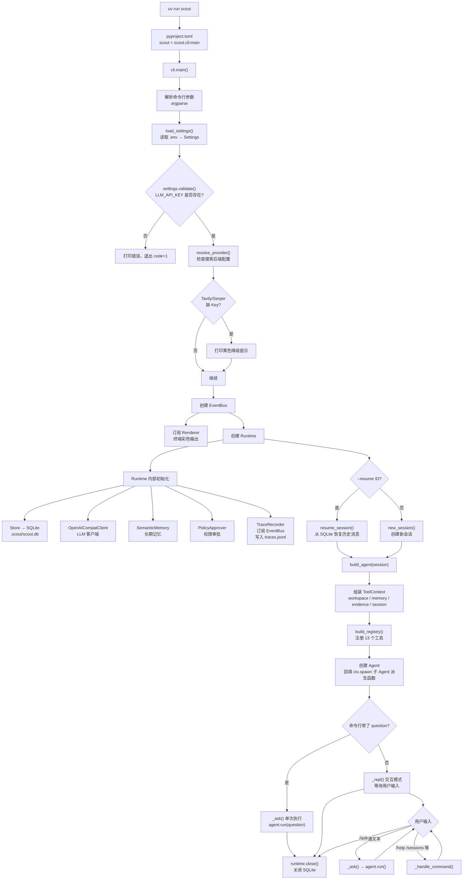
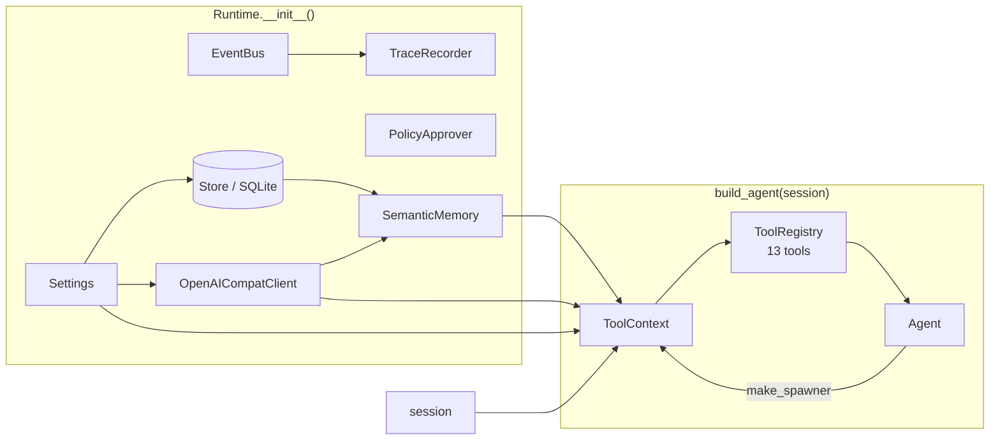
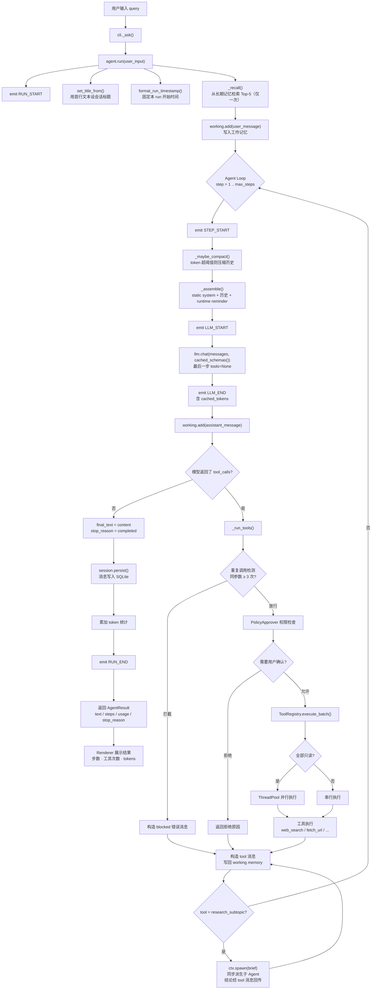
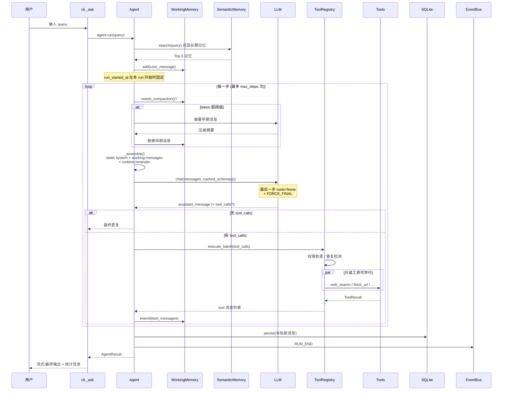
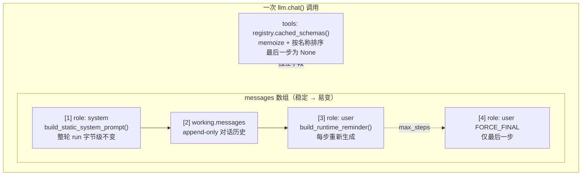
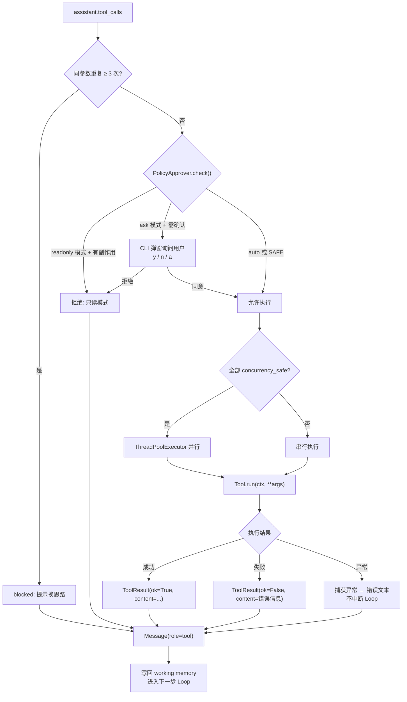
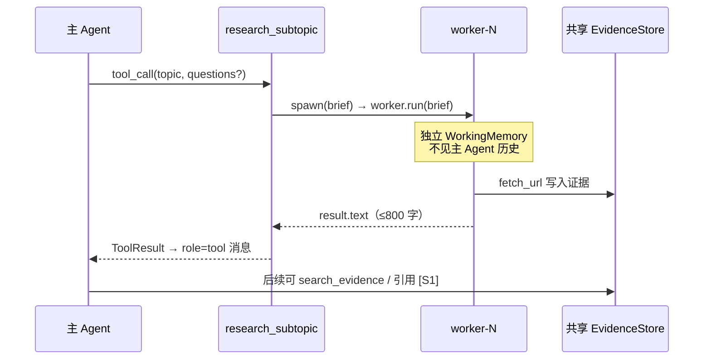
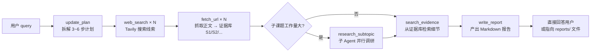
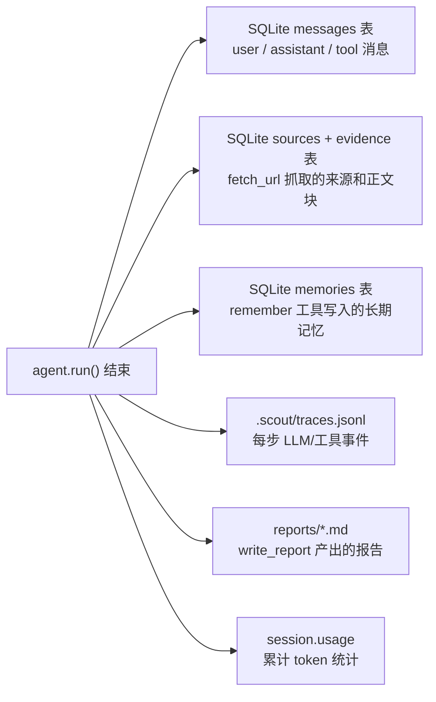
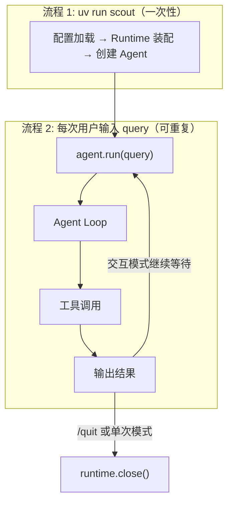

# Scout 执行流程

本文档总结两个核心流程：

1. **`uv run scout` 启动时做了什么**
2. **用户输入 query 后，Agent 如何执行**

对应源码入口：`pyproject.toml` → `scout.cli:main` → `cli.py` → `runtime.py` → `core/agent.py`。

---

## 1. `uv run scout` 启动流程

### 1.1 命令入口

```bash
uv run scout
# 等价于
# pyproject.toml 中 [project.scripts] scout = "scout.cli:main"
# → 调用 scout/cli.py 的 main()
```

### 1.2 总览流程图



### 1.3 启动阶段各模块职责

| 阶段 | 模块 | 做了什么 |
| --- | --- | --- |
| 入口 | `pyproject.toml` | 注册 `scout` 命令，指向 `scout.cli:main` |
| 配置 | `config.py` | 从 `.env` 加载 LLM、搜索、Agent 行为等参数 |
| 装配 | `runtime.py` | 创建 SQLite、LLM 客户端、长期记忆、Trace、权限器 |
| 会话 | `core/session.py` | 新建或恢复会话，挂载工作记忆和证据库 |
| 工具 | `tools/registry.py` | 注册搜索、抓取、证据、计划、报告等 13 个工具 |
| Agent | `core/agent.py` | 组装 Agent Loop，注入子 Agent 派生能力 |
| 展示 | `cli.py Renderer` | 订阅事件总线，把工具调用、压缩、子 Agent 等渲染到终端 |
| 持久化 | `observability/trace.py` | 同步订阅事件，写入 `.scout/traces.jsonl` |

### 1.4 Runtime 装配细节



---

## 2. 用户输入 Query 后的 Agent 执行流程

用户输入可以是：

- 交互模式：`› 调研一下 Qdrant 和 Milvus 的区别`
- 单次模式：`uv run scout "调研一下 Qdrant 和 Milvus 的区别"`

两者最终都调用 `_ask()` → `agent.run(question)`。

### 2.1 总览流程图



### 2.2 单步 Loop 详细流程

每一步 Loop 内部按以下顺序执行：


注：在执行过程中，事件都会调用EventBus进行

### 2.3 `_assemble()`：每步组装的上下文

`WorkingMemory` 只存 user / assistant / tool 对话。**system 和 runtime reminder 不在 working memory 里**，每步调用 LLM 前由 `_assemble()` 临时拼进请求。

对应源码：`core/agent.py::_assemble()` + `core/prompts.py`。

#### 完整请求结构



#### static system（`build_static_system_prompt`）

| 块 | 来源 | 是否变化 |
| --- | --- | --- |
| 行为准则 | `prompts.LEAD_SYSTEM` | 否 |
| 工作区 / 搜索后端 / 步数上限 | `_static_runtime_block()` | 否 |
| 可用工具名称 | `registry.tools` 名称列表 | 否（同一 Agent 整 run 不变） |

子调研员（`role=worker`）用 `build_worker_static_prompt()`，只含 `WORKER_SYSTEM`。

#### runtime reminder（`build_runtime_reminder`）

追加在 messages **末尾** 的 `role=user` 消息，以 `【当前运行时状态】` 开头：

| 块 | 来源 | 是否变化 |
| --- | --- | --- |
| 任务开始时间 / 子 Agent 配额 | `_volatile_runtime_block()` | 配额会变，时间整 run 固定 |
| 长期记忆 Top-5 | `run()` 入口 `_recall()`，整轮复用 | 否 |
| 调研计划 | `session.plan.render()` | 是（update_plan 后） |
| 已收录来源 | `session.evidence.sources()` | 是（fetch_url 后） |

reminder **不写入 working memory**，不 persist，不参与压缩。

#### tools cache block

工具 schema 通过 API 的 `tools` 字段单独发送（不在 messages 里）。`ToolRegistry.cached_schemas()` 对 schema memoize 并按工具名排序，避免顺序抖动导致 prefix cache miss。

#### prefix cache 验证

智谱 GLM 等平台支持隐式上下文缓存。trace 的 `llm_end` 事件含 `cached_tokens` 字段：

```bash
jq -r 'select(.type=="llm_end") | "\(.step) cached=\(.cached_tokens)"' .scout/traces.jsonl
```

详见 `design.md` §7。

### 2.4 工具执行分支

模型一次可能请求多个工具，执行路径如下：



### 2.5 子 Agent 派生与通信

#### 什么时候会派生

**无自动触发**——仅当主 Agent LLM 在某步调用 `research_subtopic` 工具时派生。典型场景：子课题搜索/阅读量大，但主 Agent 只需一段结论（见 `prompts.LEAD_SYSTEM`）。

硬约束：

- `subagents_used < max_subagents`（默认 3），否则工具返回失败
- 子 Agent 无 `research_subtopic`，不可递归
- 同一轮多个 `research_subtopic` 可并行（`concurrency_safe=True`）

#### 主从如何通信



| 方向 | 载体 | 内容 |
| --- | --- | --- |
| 主 → 子 | `brief` 字符串 | `topic` + 可选 `questions`；**须自包含背景** |
| 子 → 主 | `role=tool` 消息 | 子 Agent 最终 `result.text`，无中间步骤 |
| 双向共享 | `Session.evidence` | 子 Agent 抓取的正文，主 Agent 可引用 `[S1]` |
| 隔离 | `WorkingMemory` | 各自独立；子 Agent `persist=False` 不入 SQLite |

代码路径：`tools/delegate.py` → `ctx.spawn`（`runtime.py` 注入）→ `agent.make_spawner()`。

### 2.6 典型调研任务的执行路径

以一个调研问题为例，Agent 通常会按以下顺序调用工具：



### 2.7 终止条件

Agent Loop 有三种结束方式：

| stop_reason | 触发条件 | 行为 |
| --- | --- | --- |
| `completed` | 模型返回纯文本，不再请求工具 | 正常结束，输出最终答复 |
| `max_steps` | 达到 `AGENT_MAX_STEPS` 上限 | 最后一步不提供 tools，追加 FORCE_FINAL 指令，强制基于现有信息收尾 |
| `error` | Loop 内抛出未捕获异常 | 返回错误信息，已产生的消息仍会 persist |

### 2.8 数据持久化

一轮 query 执行完后，以下数据会被写入：



---

## 3. 两个流程的关系



**一句话总结**：

- **流程 1** 是"把机器开起来"——读配置、连数据库、注册工具、创建 Agent，只做一次。
- **流程 2** 是"开始干活"——每输入一个问题，Agent 就在 Loop 里反复「想 → 调工具 → 看结果 → 再想」，直到给出最终答案。
